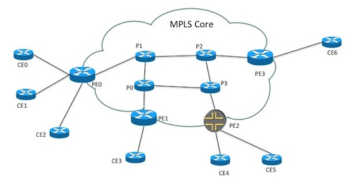

[](https://developer.cisco.com/codeexchange/github/repo/annately/cwm-workflows)

<p align="center">
  <h3 align="center"> Building and Running Workflows</h3>
  <p align="center">with Crosswork Workflow Manager
    <br>
  </p>
</p>


## Table of contents

- [Introduction](#introduction)
- [Prerequisites](#prerequisites)
- [Environment Preparation](#environment-preparation)
- [Workflow Definition](#workflow-definition)
- [Workflow Definition](#workflow-definition)
- [Resources](#resources)


## Introduction

Crosswork Workflow Manager (CWM) provides a centralized platform for creating, managing, and executing workflows. 
In this repository you can find examples of workflows towards NSO and Netbox using pre-built adapters to: 
  - Configure devices with L3VPN service with NSO restconf adapter.
  - Get subnet information for the service from Netbox with generic REST adapter.
  - Post workflow completion notification in Webex space with generic REST adapter.
  - Combine previously written workflows as a subworkflows (child workflows)


## Prerequisites
- **CWM** installed using OVA
  - Generic REST adapter
  - NSO adapter
- **NSO** local install
- **Netbox** instance
- **Webex** account


## Environmnent Preparation
  NSO example that we use for the purposes of this workflow is setting up a Layer3 VPN in a service provider MPLS network for two NSO-simulated devices. Example is available in NSO:
```examples.ncs/service-provider/mpls-vpn-new-template```

The Layer3 VPN service configures the CE/PE routers for the endpoints
in the VPN with BGP as the CE/PE routing protocol.

### Start NSO Example

Make sure you start clean and  no old configuration data is present.

```make stop clean all start```
 
This will setup the environment and start the simulated network.


### CWM Configuration

#### Adapter and Worker

Workflow Adapters are tools that allow a workflow to interact with systems outside the CWM. You can see them as agents between the CWM and any external services (in this example NSO and Netbox). Their role is to cause an action in an outside system that's part of a workflow stream, or to retrieve data required by a workflow to progress. 

Open CWM in browser, in *Admin* tab, go to *Adapters*, upload adapter file by clicking *Add Adapter*.
Check *Create Worker* box to automatically create worker for installed adapter.


#### Resource and Secret
We need to define the resources and secrets to be passed in securely to the Cisco NSO adapter to authenticate to desired applications. In *Admin* tab:


1. Create secret to save authentication credentials towards appplication, you can choose from various secret types.
2. Create resource for the application.


> [!NOTE]
> Please find detailed instructions on how to install adapter and configure resouce and secret: [CWM Documentation](https://www.cisco.com/c/en/us/td/docs/net_mgmt/cisco_workflow/cisco-crosswork-workflow-manager-get-started-guide/m_run-example-workflow-using-cisco-nso-adapter.html)


## Workflow Definition
Workflows are defined using a standardized *Domain Specific Language* based on the [Serverless Workflow specification](https://github.com/serverlessworkflow/specification/blob/main/examples/README.md), enabling workflow designers to express complex business processes, dependencies, and decision logic in a unified and readable format.

### Workflow 1 - VPN Service Configuration
The purpose of this example workflow is to automatically create a VPN service instance in NSO and configure devices.
We want to translate NSO commands into actions executed in a workflow.
Workflows can be written either in JSON or YAML, all examples available in this repository are JSON files. 


1.  Configure VPN service instance and its route distinguisher. In CLI it would be:
```
vpn l3vpn volvo
route-distinguisher 999
```
In our workflow it looks like this: 

```
"name": "CreateVPN",
"retryRef": "Custom",
"functionRef": {
"refName": "NSO.RestconfPost",
"arguments": {
      "input": {
      "data": "{\"l3vpn\":[{\"name\":\"${ .vpn.name }\",\"route-distinguisher\":\"${ .vpn.rd }\"}]} ",
      "path": "restconf/data/l3vpn:vpn"
      },
      "config": {
      "resourceId": "NSOLocal"
      }}},
```


2. Configure VPN endpoints. We would define 3 of them in CLI:

```
vpn l3vpn volvo
endpoint main-office
ce-device    ce6
ce-interface GigabitEthernet0/11
ip-network   10.10.1.0/24
as-number    65101
bandwidth    12000000
!
endpoint branch-office1
ce-device    ce1
ce-interface GigabitEthernet0/11
ip-network   10.7.7.0/24
as-number    65102
bandwidth    6000000
!
endpoint branch-office2
ce-device    ce4
ce-interface GigabitEthernet0/18
ip-network   10.8.8.0/24
as-number    65103
bandwidth    300000
```

In workflow we will use *foreach* action to execute it 3 times, once for each endpoint

```

"name": "ConfigureEndpoints",
"type": "foreach",
"actions": [
      {
      "name": "ConfigureEndpoint",
      "retryRef": "Custom",
      "functionRef": {
      "refName": "NSO.RestconfPost",
      "arguments": {
            "input": {
            "data": "{\"endpoint\": {\"id\": \"${ .endpoint.name }\",\"ce-device\": \"${ .endpoint.ce }\",\"ce-interface\": \"${ .endpoint.int }\",\"ip-network\": \"${ .endpoint.ip }\",\"bandwidth\": \"${ .endpoint.bw }\"}}",
            "path": "restconf/data/l3vpn:vpn/l3vpn=volvo"
            },
            "config": {
            "resourceId": "NSOLocal"
            }}},
```

Endpoint information, as well as vpn name and RD, comes as an [input](workflows/1/configure_vpn_service.input.json) to the Workflow.


Please find workflow complete JSON file [here](workflows/1/configure_vpn_service.json).


#### Run Workfow
To run Workflow, navigate to Workflows tab in CWM UI


Click *Create New Workflow*.


Once created click on the newly created workflow.


Go to *Code* tab and paste workflow JSON file and save changes


Click Run button, provide example [input data JSON](workflows/1/configure_vpn_service.input.json).


Once wokflow execution job is started, you can go to job tab to see the results. 

#### Verify Results

 The results are visible in Cisco NSO. 

 


### Workflow 2 - Allocate Prefix in Netbox

This workflow task is to allocate subnet in Netbox, that later can be used in L3VPN configuration. The communication with Netbox is going to take advantage of generic REST adapter. It means we have to specify exact path and payload of the resource that we want too use. In this example it will be POST to Netbox /api/ipam/prefixes/ with prefix and description in request body.

Please find workflow complete JSON file [here](workflows/2/allocate_prefixes.json).


Once workflow is completed we can se results in Netbox.


### Workflow 3 - Send Webex Notification

Generic REST API adapter can be used to comunicate with any external service acccessible with REST API. In this example we will write workflow that notifies user on its completion.


Please find workflow complete JSON file [here](workflows/3/webex.json).


### Workflow 4 - Reuse previously written workflows in one workflow executing all the above actions


We can reuse previously created workflows in newly created workflow by calling them inside new workflow definition. Please find workflow complete JSON file [here](workflows/4/netbox_nso_with_child_wfs.json). 

## Resources
